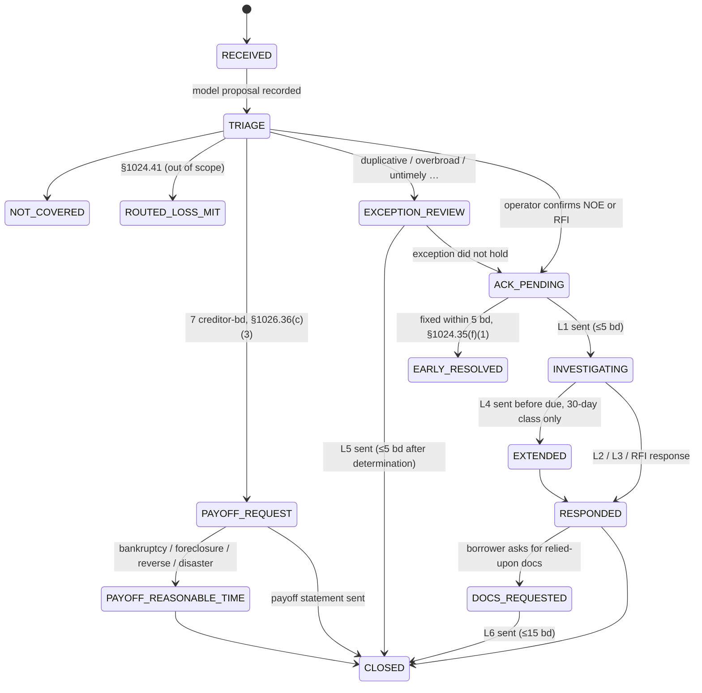

# servicing-desk

A borrower-correspondence desk for mortgage servicing operations: the Regulation X notice-of-error /
request-for-information workflow (12 CFR §1024.35 / §1024.36) plus payoff requests (Reg Z §1026.36(c)(3)),
built as a case state machine with persisted regulatory clocks, a transactional outbox, and an LLM that
**proposes** triage while an operator **decides**.

The old way this runs is a shared mailbox, a spreadsheet of due dates, and a reviewer who remembers which
sentence each letter must contain. Every one of those is a thing this system refuses to leave to memory.

## Three rules the design follows

1. **The model has no write access.** It reads a letter and returns a proposal — case type, error category,
   the three statutory elements, exception flags — with a verbatim quote for every value and `null` where the
   letter is silent. An operator approves or edits it; the *approved* version, not the model output, is what
   moves the case. Both are stored, and the audit row lists which fields the operator changed.
2. **A deadline is a row, not a calculation.** Each clock (`ACK`, `RESPONSE`, `EXTENSION`, `DOCS`, `PAYOFF`,
   `CREDIT_REPORTING_HOLD`) is persisted with its due date, its calendar, and the citation that created it.
   A worker sweeps due rows; a restart loses nothing. Three calendars exist because the rules use three
   definitions of a day (see below).
3. **State changes and their side effects commit together.** `state_machine.transition()` updates the case,
   appends an audit row, adjusts clocks, and appends outbox events in one transaction. Nothing in that
   function talks to Kafka, a printer, or a credit bureau; consumers read the outbox. §1024.38(c) says the
   servicing file must show what happened — an outbox is how you make that true under failure.
4. **No distributed transactions.** Anything that touches a second system (the ledger, the mail vendor, the
   credit bureau) is a saga: one local transaction per step, an event between steps, and a *forward*
   compensating action when a later step fails — a reversing ledger entry, a voided letter — never a rollback
   that pretends the first step did not happen.

## Workflow



### Clocks

| Clock | Days | Calendar | Rule |
|---|---|---|---|
| Acknowledgment | 5 | Reg X bd | §1024.35(d) / §1024.36(c) |
| Response — payoff-balance error (b)(6) | 7 | Reg X bd | §1024.35(e)(3)(i)(A) |
| Response — foreclosure errors (b)(9)/(10) | min(sale date, 30) | Reg X bd | §1024.35(e)(3)(i)(B) |
| Response — any other error | 30, +15 with notice before due | Reg X bd | §1024.35(e)(3)(i)(C), (e)(3)(ii) |
| Response — RFI, owner/assignee identity | 10 | Reg X bd | §1024.36(d)(2)(i)(A) |
| Response — RFI, other | 30, +15 with notice | Reg X bd | §1024.36(d)(2)(i)(B), (d)(2)(ii) |
| Exception notice | 5 after determination | Reg X bd | §1024.35(g)(2) / §1024.36(f)(2) |
| Relied-upon documents | 15 | Reg X bd | §1024.35(e)(4) |
| Payoff statement | 7 | Reg Z bd | §1026.36(c)(3) |
| Credit-reporting hold | 60 | calendar | §1024.35(i)(1) |

**Three calendars.** Reg X subpart C counts "days excluding legal public holidays, Saturdays, and Sundays"
(`reg_x_bd`); Reg Z §1026.36 uses the *general* business day — a day the creditor is open
(`reg_z_bd`, configurable via `CREDITOR_CLOSED_DAYS`); §1024.31 makes the 60-day hold calendar days.
Assumption: "legal public holidays" in Reg X means the federal list in 5 U.S.C. 6103(a) — Reg Z says so
explicitly for its special definition; Reg X does not define the term.

### Letters

Every template's required contents are a Pydantic schema (`letters.py`), so an acknowledgment without a
receipt date or a no-error letter without the borrower's right to request documents cannot be rendered.
Transitions that legally require a letter (`state_machine.REQUIRED_LETTER`) refuse to run until one exists.

## Topology

```
                     outbox (Postgres)
                          │ relay (FOR UPDATE SKIP LOCKED → produce → ack → mark published)
                          ▼
            Kafka  desk.case-events   key = case_id, 6 partitions
                          │
   ┌──────────────┬───────┴───────┬───────────────┬───────────────┐
 triage-worker  letter-worker  ledger-worker  credit-worker   saga-worker
 (model call)   (mail vendor,  (system of     (60-day hold,   (Respond saga
                 can fail)      record)        released by     orchestrator)
                                               its own clock)
```

One topic, keyed by case id, on purpose: Kafka orders within a partition, and what must stay ordered is
"everything that happened to case X". Each consumer group sees every event and filters by type; a group that
starts late catches up from its own offset. Both ends are at-least-once (relay: produce → ack → mark;
consumer: handle in a DB transaction → commit → commit offset) and `outbox.consume()` dedupes on event id per
group, which is what makes the whole thing effectively-once. Without `KAFKA_BOOTSTRAP` the same handlers run
under an in-process relay (`desk-worker all`), which is how the tests run.

### The Respond saga

```
/respond ─► [apply_correction] ─► deliver_letter ─► finish (case → RESPONDED, actor "saga:<operator>")
                  │                     │
                  │                     └─ fails N times ─► COMPENSATING: void letter, reverse ledger ─► COMPENSATED
                  └─ skipped when the letter carries no adjustment (L3, RFI response)
```

Orchestration, not choreography: one `sagas` row says which step a case is on, who started it, how many
attempts, and the last error. The correction is posted to the ledger *before* the borrower is told it is
effective; if the letter then cannot go out, the ledger gets a reversing entry (history kept) and the case
stays in `INVESTIGATING` with a `needs_attention` audit row. `LETTER_FAIL_RATE` makes the vendor flaky so
you can watch it happen.

## Layout

```
backend/servicing_desk/
  models.py         tables: correspondence, cases, proposals, clocks, letters, audit_log, outbox, processed_events
  calendars.py      reg_x_bd / reg_z_bd / calendar
  clocks.py         ClockRule per citation; due-date math incl. the foreclosure-sale cap
  state_machine.py  TRANSITIONS, REQUIRED_LETTER, transition() — the only place status changes
  letters.py        required-contents schemas + templates
  outbox.py         consume() with per-group dedupe; in-process relay
  bus.py            Kafka transport: relay (producer) + generic consumer-group loop
  saga.py           Respond saga: start, orchestrator handlers, compensation
  effects.py        side-effect consumers: letter vendor, ledger, credit hold
  handlers.py       consumer group → handlers registry (both transports read it)
  service.py        intake (idempotent), record_proposal, approve_triage, send_letter, respond
  triage/           TriageProposal schema; agent.py = Claude structured output; gemini.py = same contract on Gemini; stub.py = keyword rules
  workers/          clock_worker.sweep; cli.py = `desk-worker <role>`
  api/main.py       FastAPI: /intake, /cases, …/approve, …/letters, …/respond, …/transition, …/audit, …/effects
backend/tests/      34 tests on SQLite — calendars, clocks, transitions, letters, outbox, saga paths, HTTP lifecycle
```

## Run

```bash
docker compose up -d                # postgres + kafka (KRaft, single broker)
cd backend
uv venv && uv pip install -e ".[dev]"
cp ../.env.example .env            # a triage key (or TRIAGE_PROVIDER=stub), KAFKA_BOOTSTRAP=localhost:9092
.venv/Scripts/desk-seed             # five synthetic letters
.venv/Scripts/desk-api              # http://localhost:8000/docs
```

Then one process per role (Kafka mode):

```bash
desk-worker relay          # outbox → topic
desk-worker clock          # sweeps due clocks (+ relay)
desk-worker triage-worker  # and letter-worker, ledger-worker, credit-worker, saga-worker
```

Without Kafka, `desk-worker all` runs the sweep and every handler in one loop.

`TRIAGE_PROVIDER` picks the backend: `claude` (Anthropic key), `gemini` (AI Studio key, free tier), or `stub`. The stub swaps the model for keyword rules (same proposal contract, every value still quotes the letter) so the whole pipeline runs in CI and on a laptop without a key. Tests need no database or API key:

```bash
cd backend && .venv/Scripts/python -m pytest
```

## Roadmap

- ~~Step 2 — split and stream.~~ Done: Kafka relay, five consumer groups, Respond saga with compensation.
- **Step 3 — run it somewhere.** `k8s/` manifests: API and worker Deployments, clock sweep as a CronJob, HPA
  on the triage worker (the only component whose cost is the model call), StatefulSets for Postgres/Kafka.
- **Operator UI.** Next.js queue: cases by due date, proposal with source quotes side-by-side with the
  letter, approve / edit / flag exception, letter composer that shows which required fields are missing.

## Not in scope, on purpose

- Loss mitigation (§1024.41) is routed out. Its rules are mid-rewrite (CFPB 2024 proposal) and its branching
  is several times this desk's.
- Escrow analysis (§1024.17) is arithmetic on system data, not a correspondence workflow.
- This is a demo with synthetic data. It encodes the regulation as I read it; nothing here is legal advice,
  and a real deployment would have compliance review the clock table before trusting it.
